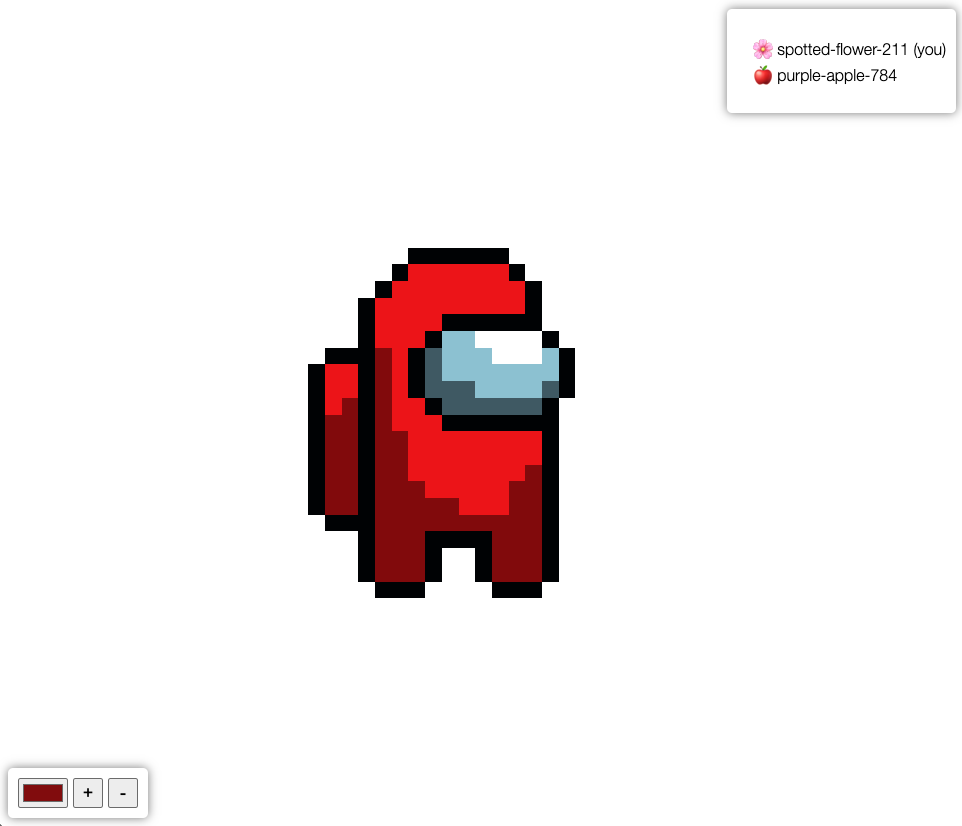

# Pixel Canvas App

Took inspiration from [r/place](https://www.redditinc.com/blog/how-we-built-rplace) to create a real time bit art application.



## Getting Started

```bash
# install nvm and docker if you haven't already
nvm install # or make sure you use the equivalent Node.js version found in .nvmrc
make install
make build
make start
# in new tab or directly in browser
make create-canvas # creates a new canvas that is 100px x 100px
open http://localhost:3000
```
